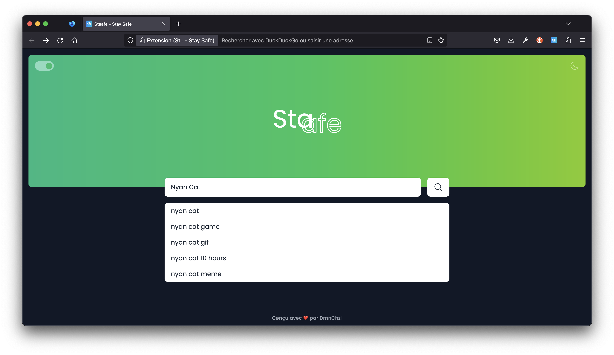

# Staafe - Stay Safe

> 1.0.0

Search the web quickly, directly from opening a new tab or from the popup. Based on the **DuckDuckGo** and **Ecosia** search engines, and their "_strict_" mode.

## Preview




## How To Install

### Firefox

1. Go To `about:config`
2. Toggle `xpinstall.signatures.required` To **false**
3. Go To `about:addons`
4. Install Add-On From File

### Chrome

1. Go To `chrome://extensions`
2. Toggle Developer Mode
3. Load Unpacked

## Miscellaneous

If you want more,

You can clone the project:

```
git clone https://github.com/dmnchzl/staafe.git
```

Install dependencies:

```
yarn install
```

Develop locally:

```
yarn dev
```

If you want, format the code:

```
yarn format
```

Compile the project:

```
yarn build
```

Compile the project (as an extension):

```
yarn build:ext --overwrite-dest
```

Enjoy 👍

### Note

Run the server:

```
deno run --allow-net server.ts --host=127.0.0.1 --port=1271 --cors
```

## License

```
"THE BEER-WARE LICENSE" (Revision 42):
<phk@FreeBSD.ORG> wrote this file. As long as you retain this notice you
can do whatever you want with this stuff. If we meet some day, and you think
this stuff is worth it, you can buy me a beer in return. Damien Chazoule
```
